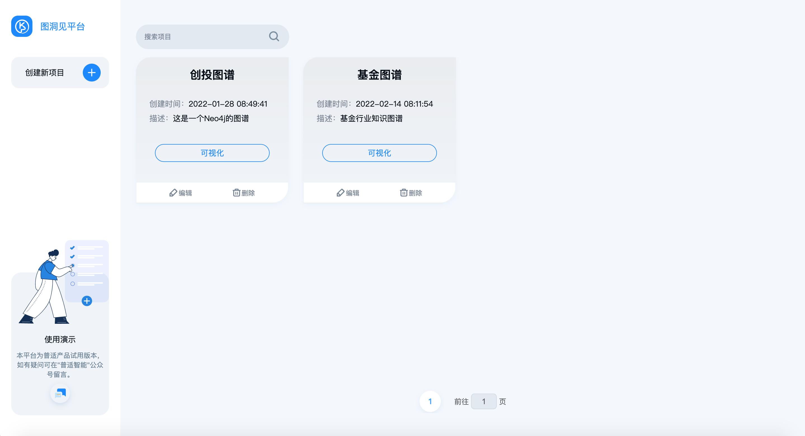
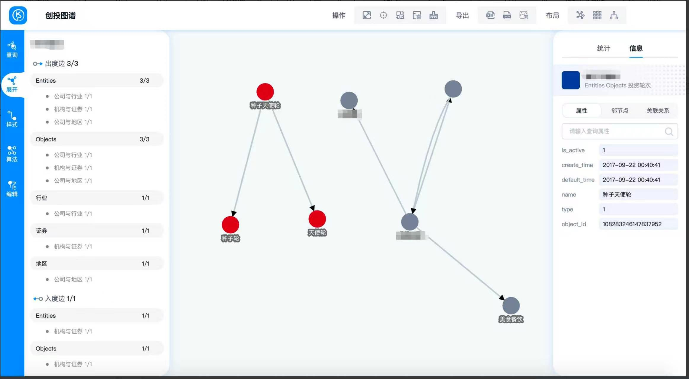

# GraphInsight - 普适智能图洞见平台

普适智能图洞见平台（GraphInsight）是一个基于浏览器内核的桌面版图可视化应用程序，平台通过创建图数据库链接访问、编辑和展示图数据。该平台可以支持离线环境运行，封闭网络和高敏感度的应用环境也可以正常使用。

图洞见平台定位为图数据库查询/编辑/可视化工具，使用者可以通过多种方式便捷的对图数据进行访问和搜索，界面上支持上万节点的关系图渲染，方便分析人员使用托拉拽等可视化交互挖掘隐藏在多层关系上的重要信息，适用于金融风控、车险反欺诈、基金产业链分析、数据血缘分析等多种分析场景。平台通过点边关系这种直观的信息呈现方式，最大程度上符合了人的思维模式，让使用者在新的工作模式和分析模式中充分挖掘数据价值。

## 功能截图

<p align="center">
  
</p>
<p align="center">
  
</p>

## 核心功能

- **图数据库连接** — 创建平台跟图数据库的链接
- **图数据查询** — 对图数据库中的点边数据进行查询
- **图数据可视化** — 过滤、布局、样式、统计、时间轴等
- **图数据编辑** — 新增、编辑、删除图的点边数据

## 本体模型（Ontology）

本平台基于**属性图（Property Graph）**模型，采用**动态本体发现**机制——本体结构并非硬编码，而是从所连接的图数据库中自动发现和解析。

### 实体（Vertex / Entity）

图中的节点，代表现实世界中的实体对象。

| 属性 | 说明 |
|------|------|
| `id` | 图数据库内部 ID |
| `uniquelyId` | 业务唯一标识 |
| `name` | 实体显示名称 |
| `labels` | 实体类型标签（可多个） |
| `type` | 自定义实体分类 |
| `attributeList` | 动态属性列表（最多 300 个自定义属性） |

### 关系（Edge / Relationship）

连接两个实体的有向边，代表实体间的关联。

| 属性 | 说明 |
|------|------|
| `id` | 图数据库内部 ID |
| `uniquelyId` | 业务唯一标识 |
| `name` | 关系显示名称 |
| `type` | 关系类型 |
| `startVertexId` | 起点实体 ID |
| `endVertexId` | 终点实体 ID |
| `attributeList` | 动态属性列表 |

### 属性（Attribute）

实体和关系共享的灵活键值对模型：

| 字段 | 说明 |
|------|------|
| `name` | 属性名称 |
| `value` | 属性值（任意类型） |
| `fieldType` | 数据类型信息 |

### 图模式（Schema）

系统通过 Schema API 动态获取当前图数据库的模式信息：

- **vertexList** — 所有实体类型
- **edgeList** — 所有关系类型
- **attributeList** — 全部可用属性名
- **vertexIndexList / edgeIndexList** — 已建立索引的属性

### 数据导入

支持通过 **Excel 模板**批量导入图数据，模板结构如下：

**实体表：**

| 列 | 说明 |
|----|------|
| 实体类型 | 必填，顶点分类 |
| 序号 | 可选，用于关系引用 |
| 属性名称 1-300 | 自定义属性名 |
| 属性值 1-300 | 对应属性值 |
| 是否索引 1-300 | 是否对该属性建索引 |

**关系表：**

| 列 | 说明 |
|----|------|
| 关系类型 | 必填，边类型 |
| 关系起点序号 | 必填，引用实体表序号 |
| 关系终点序号 | 必填，引用实体表序号 |
| 属性名称 1-300 | 自定义属性名 |
| 属性值 1-300 | 对应属性值 |

### 可视化样式

每种实体类型和关系类型均可独立配置可视化样式：

- **color** — 显示颜色
- **size** — 显示尺寸（1X / 2X 等）
- **icon** — 图标标识
- **priority** — 显示优先级（1 为最高）

## 运行环境

- macOS
- Windows

## 项目结构

```
graph-visualization/
├── backend/           # 后端服务（Spring Boot）
│   ├── gv-pom/        # 根 POM（依赖管理）
│   ├── gv-base/       # 基础模块（entity/common/config/exception）
│   ├── gv-component/  # 组件模块（graph-engine/redis）
│   └── gv-web/        # Web 应用
├── frontend/          # 前端应用（Electron + Vue）
└── docs/              # 文档与截图
```
